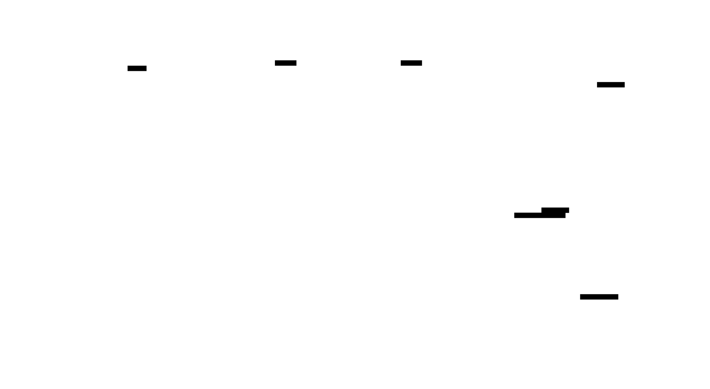
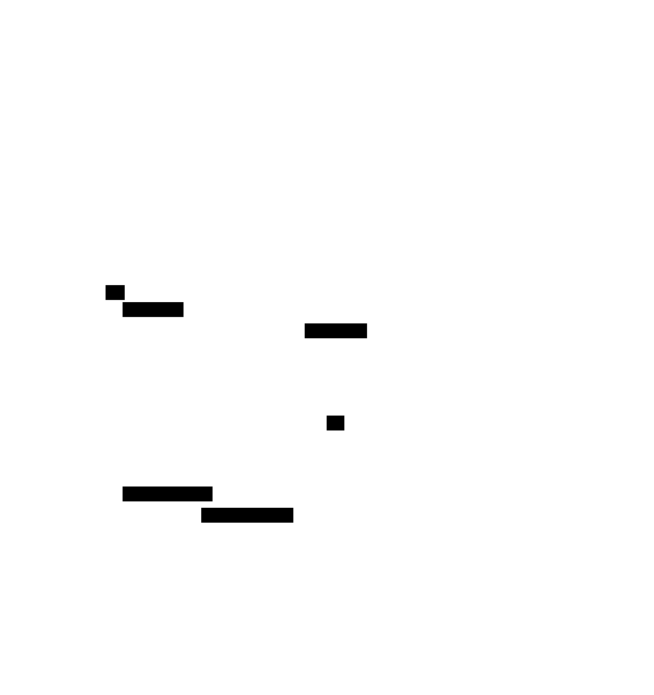
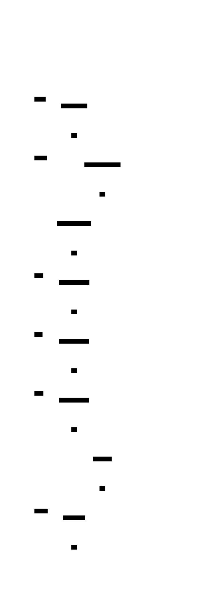

# Dagster


## About

The following is a description of the steps and requirements for
building and deploying the docker based workflow implemented in 
dagster.

### Overview

The image following provides a broad overview of the elements that 
are loaded in to the Docker orchestration environment.  This is a very 
basic view and doesn't present any scaling or fail over elements.  

The key elements are:

* sources to configuration  to load into the Gleaner and Nabu tools, and push to the triplestore. These are now stored in
an s3 location
  * gleaner configuration. a list of sources to load
  * tenant configuration. a list communities, and which sources they load
* The Dagster set which loads three containers to support workflow operations
* The Gleaner Architecture images which loads three or more containers to support 
  * s3 object storage
  * graph database (triplestore)
  * headless chrome for page rendering to support dynamically inserted JSON-LD
  * any other support packages like text, semantic or spatial indexes
* The GleanerIO tools which loads two containers  as services (Gleaner and Nabu) that are run 
and removed by the Dagster workflow




## Steps to build and deploy

The deployment can be tested locally using docker.
The production 'containers' are built with a github action, or using a makefile.

This describes the local and container deployment
We use portainer to manage our docker deployments.

1) move to the the deployment directory
2) copy the envFile.env to .env 
3) edit the entries.
4) for local, `./dagster_localrun.sh`
5) go to http://localhost:3000/

To deploy in portainer, use the deployment/compose_project.yaml docker stack.

### docker compose Configuration:
1) there are three files that need to be installed into docker configs. 

 (NOTE: I think the configs are still needed in the containers) 

| file               | local                               | stack | note                     |
|--------------------|-------------------------------------| ------ |--------------------------|
| workspace          | configs/PROJECT/worksapce.yaml      | env () | used by dagster          |
| gleanerconfig.yaml | configs/PROJECT/gleanerconfigs.yaml | env () | needs to be in portainer |
| nabuconfig.yaml    | configs/PROJECT/nabuconfigs.yaml    | env () | needs to be in portainer |


## Upload the configs


## MAKEFILE
1) Place your gleanerconfig.yaml (use that exact name) in _confgis/NETWORK/gleanerconfig.yaml_
   1) Note:  When doing your docker build, you will use this NETWORK name as a value in the command such as
   ```bash
   podman build  --tag="docker.io/fils/dagster_nsdf:$(VERSION)"  --build-arg implnet=nsdf --file=./build/Dockerfile 
   ```
1) Make any needed edits to the templates in directory _templates/v1/_ or make your own template set in that directory

The command to build using the pygen.py program follows.  This is done from the standpoint of running in from the 
implenet directory.

```bash
 python pygen.py -cf ./configs/nsdf/gleanerconfig.yaml -od ./generatedCode/implnet-nsdf/output  -td ./templates/v1   -d 7
```

1) This will generate the code to build a dagster instance from the combination of the templates and gelanerconfig.yaml.
2) 


### Environment files

1) cp deployment/envFile.env .env
2) edit
3) `export $(cat .env | xargs)`
export $(cat .env | xargs)
``` bash
######
# Nabu and Gleaner configs need to be in docker configs
## docker config name GLEANER_GLEANER_DOCKER_CONFIG
## docker config name GLEANER_NABU_DOCKER_CONFIG
#        suggested DOCKER_CONFIG NAMING PATTERN (nabu||gleaner)-{PROJECT}
########
GLEANERIO_GLEANER_DOCKER_CONFIG=gleaner-eco
GLEANERIO_NABU_DOCKER_CONFIG=nabu-eco

# ###
# workspace for dagster
####
GLEANERIO_WORKSPACE_CONFIG_PATH=/usr/src/app/workspace.yaml
GLEANERIO_WORKSPACE_DOCKER_CONFIG=workspace-eco


DEBUG=False
GLEANERIO_CONTAINER_WAIT_SECONDS=300
# debuggin set to 5 or 10 seconds
PROJECT=eco
CONTAINER_CODE_TAG=latest
CONTAINER_DAGSTER_TAG=latest
#PROJECT=iow
#PROJECT=oih
HOST=localhost
PROTOCOL_BUFFERS_PYTHON_IMPLEMENTATION=python
# port is required: https://portainer.{HOST}:443/api/endpoints/2/docker/
PORTAINER_URL=
PORTAINER_KEY=
# if running dagster-dev, then this needs to be set ,
#       defaults to "/scheduler/gleanerconfig.yaml" which is path to config mounted in containers
# when debugging generated code "../../../configs/eco/gleanerconfig.yaml"
# when debugging code in workflows "../../configs/eco/gleanerconfig.yaml"
# DAGSTER_GLEANER_CONFIG_PATH=../../../configs/eco/gleanerconfig.yaml
GLEANERIO_CONTAINER_WAIT_SECONDS=3600
#GLEANERIO_CONTAINER_WAIT_SECONDS=30
# Network
GLEANERIO_HEADLESS_NETWORK=headless_gleanerio

### GLEANER/NABU Dockers
GLEANERIO_GLEANER_IMAGE=nsfearthcube/gleaner:latest
GLEANERIO_NABU_IMAGE=nsfearthcube/nabu:latest

##
# path where configs are deployed/mounted
####
GLEANERIO_GLEANER_CONFIG_PATH=/gleaner/gleanerconfig.yaml
GLEANERIO_NABU_CONFIG_PATH=/nabu/nabuconfig.yaml
###
#path in s3 for docker log files
GLEANERIO_LOG_PREFIX=scheduler/logs/

GLEANERIO_MINIO_ADDRESS=
GLEANERIO_MINIO_PORT=80
GLEANERIO_MINIO_USE_SSL=false
GLEANERIO_MINIO_BUCKET=
GLEANERIO_MINIO_ACCESS_KEY=
GLEANERIO_MINIO_SECRET_KEY=
GLEANERIO_HEADLESS_ENDPOINT=http://headless:9222

# just the base address, no namespace https://graph.geocodes-aws-dev.earthcube.org/blazegraph
GLEANERIO_GRAPH_URL=
GLEANERIO_GRAPH_NAMESPACE=

# example: https://graph.geocodes.ncsa.illinois.edu/blazegraph/namespace/yyearthcube2/sparql
#graph endpoint will be GLEANERIO_GRAPH_URL
GLEANERIO_SUMMARY_GRAPH_NAMESPACE=
GLEANERIO_SUMMARIZE_GRAPH=True

```

# Implementation Networks

This ([https://github.com/sharmasagar25/dagster-docker-example](https://github.com/sharmasagar25/dagster-docker-example)) 
is an example on how to structure a [Dagster] project in order to organize
the jobs, repositories, schedules, and ops. The example also contains
examples on unit-tests and a docker-compose deployment file that utilizes a
Postgresql database for the run, event_log and schedule storage.

This example should in no way be considered suitable for production and is
merely my own example of a possible file structure. I personally felt that it
was difficult to put the Dagster concepts to use since the projects own examples
had widely different structure and was difficult to overview as a beginner.

The example is based on the official [tutorial].

## Folders

* build:  build directives for the docker containers
* configs
* src
* tooling

## Requirements

At this point it is expected that you have a valid Gleaner config file named
_gleanerconfig.yaml_ located in some path within the _configs_ directory.

## Building the dagster code from templates

The python program pygen will read a gleaner configuration file and a set of 
template and build the Dagster code from there.  

```bash
python pygen.py -cf ./configs/nsdf/gleanerconfig.yaml -od ./src/implnet-nsdf/output  -td ./src/implnet-nsdf/templates  -d 7
```


## Running 

There is an example on how to run a single pipeline in `src/main.py`. First
install the dependencies in an isolated Python environment.

```bash
pip install -r requirements
```

The code built above can be run locally, though your templates may be set up 
to reference services and other resources not present on your dev machine.  For 
complex examples like these, it can be problematic.  

If you are looking for some simple examples of Dagster, check out the directory
examples for some smaller self-contained workflows.  There are good for testing
things like sensors and other approaches. 

If you wish to still try the generated code cd into the output directory
you specified in the pygen command.

Then use:

```bash
dagit -h ghost.lan -w workspace.yaml
```

## Building

```bash
 podman build  -t  docker.io/fils/dagster:0.0.24  .
```

```bash
 podman push docker.io/fils/dagster:0.0.24
```


# Appendix

## Setup




## Docker API sequence




## Appendix

### Portainer API setup

You will need to setup Portainer to allow for an API call.  To do this look 
at the documentation for [Accessing the Portainer API](https://docs.portainer.io/api/access)

## Notes

Single file testing run

```bash
 dagit -h ghost.lan -f test1.py
```

* Don't forget to set the DAGSTER_HOME dir like in 

```bash
 export DAGSTER_HOME=/home/fils/src/Projects/gleaner.io/scheduler/python/dagster
```

```
dagster-daemon run
```

Run from directory where workspace.yaml is.
```
dagit --host 192.168.202.159
```


## Cron Notes

A useful on-line tool:  [https://crontab.cronhub.io/](https://crontab.cronhub.io/)

```
0 3 * * *   is at 3 AM each day

0 3,5 * * * at 3 and 5 am each day

0 3 * * 0  at 3 am on Sunday

0 3 5 * *  At 03:00 AM, on day 5 of the month

0 3 5,19 * * At 03:00 AM, on day 5 and 19 of the month

0 3 1/4 * * At 03:00 AM, every 4 days
```


## Indexing Approaches

The following approaches

* Divide up the sources by sitemap and sitegraph
* Also divide by production and queue sources

The above will result in at most 4 initial sets.

We can then use the docker approach

```
./gleanerDocker.sh -cfg /gleaner/wd/rundir/oih_queue.yaml  --source cioosatlantic
```

to run indexes on specific sources in these configuration files.  

## References

* [Simple Dagster example](https://bakerwho.github.io/posts/datascience/Deployable-Dagster-MVP/)

