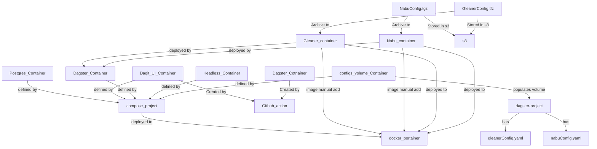

# ECO Scheduler Notes

!!! Note
    these will need to become the gleanerio scheduler documentation. 
    for now these are rough. Images and graphics need to be loaded



## Deploy

### Deploy Dagster in Portainer
You will need to deploy dagster containers to portainer, for a docker swarm
0. get the portainer url, and auth token 
0.  SSH to the  make hosting the docker.

1. Pull scheduler repo
2. cd dagster/implnets/deployment
3. create a copy of envFile.env and **edit env variables**
``` 
PROJECT=eco
    GLEANERIO_MINIO_ADDRESS ++
    GLEANERIO_GRAPH_URL,
    GLEANERIO_GRAPH_NAMESPACE
    GLEANERIO_DOCKER_URL,
    GLEANERIO_PORTAINER_APIKEY
    SCHED_HOSTNAME defaults to sched
```
5. as noted as noted in (Compose, Environment and Docker API Assets), deploy the configuration to s3. 
6. ~~create network and volumes needed `dagster_setup_docker.sh`~~
7. modify workflows to reference project ingest containers. MANUALLY CHANGE THE PROJECT TO THE PROJECT,
```
load_from:
      # module starting out with the definitions api
     # - python_module: "workflows.tasks.tasks"

      - grpc_server:
            host: dagster-code-PROJECT-tasks
            port: 4000
            location_name: "PROJECT-tasks"
      - grpc_server:
            host: dagster-code-PROJECT-ingest
            port: 4000
            location_name: "PROJECT-ingest"
```
8. manually add configs
```
  gleaner-{project}
   - nabu-{project}
   - workspace-{project}
   - tenant-{project}
   - dagster from:dagster/implnets/deployment/dagster.yaml
```  
7. add configs to S3/Minio. 
```
   - scheduler/configs/gleanerconfig.yml
   - scheduler/configs/tenant.yml
   - 
```
8. create a dagster stack,
```
   - gtibub repo: https://github.com/earthcube/scheduler.git
   - branch: dev
   - compose files: dagster/implnets/deployment/compose_project.yaml
```
8. create  ingest stack,
Name of the project is: eco
```
   - gtibub repo: https://github.com/earthcube/scheduler.git
   - branch: dev
   - compose files: dagster/implnets/deployment/compose_project_ingest.yaml
```
so workspace might look like:
```
load_from:
      # module starting out with the definitions api
     # - python_module: "workflows.tasks.tasks"

      - grpc_server:
            host: dagster-code-eco-tasks
            port: 4000
            location_name: "eco-tasks"
      - grpc_server:
            host: dagster-code-eco-ingest
            port: 4000
            location_name: "eco-ingest"
```

8. if dev, create a second stack
CHANGE THE NAME OF THE PROJECT to test for the env variables
```
   - gtibub repo: https://github.com/earthcube/scheduler.git
   - branch: dev
   - compose files: dagster/implnets/deployment/compose_project_ingest.yaml
```
so workspace might look like:
```
load_from:
      # module starting out with the definitions api
     # - python_module: "workflows.tasks.tasks"

      - grpc_server:
            host: dagster-code-eco-tasks
            port: 4000
            location_name: "eco-tasks"
      - grpc_server:
            host: dagster-code-eco-ingest
            port: 4000
            location_name: "eco-ingest
      - grpc_server:
            host: dagster-code-test-tasks
            port: 4000
            location_name: "test-tasks"
      - grpc_server:
            host: dagster-code-test-ingest
            port: 4000
            location_name: "test-ingest
```


