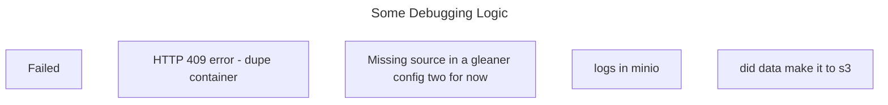

# Monitoring workfows


## scheduler interface

### check the run interface

http://localhost:3000/runs

If there is a failure, click on the runid of the run, then you can look at the run log

## portainer status

The gleaner and nabu are run as services are prefixed with sch_
pattern is

sch_PROJECT_step

so if it looks like something is not working, find the container starting with sch_project_step,

then go into a terminal, 

you may need to use bin/sh

```shell
cd logs
ls -l 
tail some log name
```

## Issues



### why did it fail
Server:
* is disk full... [find in minio logs]
Basic Source issues
* does sitemap exist [ check url]
* do urls in sitemap have jsonld [ from sitemap check some urls on validator.schema.org ]
* are the JSONLD's types we handle [@type dataset, datacatalog]

Basic Failure in gleaner
* Nonexistent partition keys [ add source gleaner configs, and run s3 job manually if needed ]
* 409_error[HTTP 409 error - dupe container running in portainer, remove old container]
* source_not_found[Missing source in a gleaner config two for now]
* logs[logs in minio]
* s3[ did data make it to s3]

release
* is there data in s3
* is there a release file in s3

summarize
* is there data in s3
* is this data a dataset?


#### 409_error

this will be found in the error in dagster

##### source_not_found
this is found in the logs for a gleaner on minio
 

##### sumarize is there data
no data returned from a summary qeury 
error in dagster
`loading Summary graph failed. argument of type 'numpy.float64' is not iterabl`e
